# LynkShort - Premium URL Shortener with Analytics

A production-ready URL shortening platform built using the MERN stack. The application allows users to create shortened URLs, generate QR codes, track click analytics, monitor referral sources, and manage links through a modern dashboard.

## Live Demo

Frontend: https://url-shortener-self-seven.vercel.app/

Backend API: https://url-shortener-1cyt.onrender.com

Demo Video (Loom): https://www.loom.com/share/332713e2e3434945976b7080028a1627

---

# Project Overview

LynkShort is a full-stack URL shortening platform designed to provide users with link management and analytics capabilities. Users can register, authenticate securely, create shortened URLs, generate QR codes, monitor click statistics, and analyze traffic sources through an interactive dashboard.

---

# Application Planning

## Problem Statement

Long URLs are difficult to share, track, and manage. Businesses and individuals require a simple solution that:

* Creates shorter URLs
* Tracks user engagement
* Provides traffic insights
* Generates QR codes for offline sharing
* Offers secure user-specific link management

## Solution

LynkShort provides:

* URL shortening
* User authentication
* QR code generation
* Click analytics
* Referral source tracking
* Device and browser tracking
* Public statistics sharing
* Personalized dashboard

---

# Features

## Authentication

* User Registration
* User Login
* JWT Authentication
* Protected Routes
* Persistent Sessions

## URL Management

* Create Short URLs
* Custom Short Code Generation
* Copy Short URL
* Delete URL
* User-specific URL Management

## Analytics

* Total Click Tracking
* Daily Click Trends
* Device Analytics
* Browser Analytics
* Operating System Analytics
* Referral Source Analytics
* Public Statistics Page

## QR Code Features

* QR Code Generation
* Download QR Codes
* Share QR Codes

## Dashboard

* Interactive User Dashboard
* URL Listing
* Analytics Access
* Public Stats Access
* Responsive Design

## Deployment

* Frontend deployed on Vercel
* Backend deployed on Render
* MongoDB Atlas Database

---

# Application Building Workflow

## Phase 1: Requirement Gathering

* Identified target users.
* Defined URL shortening requirements.
* Planned analytics collection.
* Planned authentication strategy.
* Determined deployment architecture.

## Phase 2: System Design

* Designed database schema.
* Designed API structure.
* Planned frontend routing.
* Designed analytics workflow.
* Defined authentication flow.

## Phase 3: Backend Development

Implemented:

* Express Server
* MongoDB Integration
* JWT Authentication
* URL CRUD APIs
* Redirect Handling
* Analytics Collection
* Error Handling Middleware

## Phase 4: Frontend Development

Implemented:

* React Application
* Authentication Context
* Protected Routes
* Dashboard UI
* Analytics Pages
* QR Code Modal
* Responsive Layout

## Phase 5: Testing

Tested:

* Registration
* Login
* URL Creation
* URL Redirection
* Analytics Collection
* Public Stats
* QR Code Generation

## Phase 6: Deployment

Frontend:

* Vercel

Backend:

* Render

Database:

* MongoDB Atlas

---

# Technology Stack

## Frontend

* React
* React Router
* Vite
* Lucide React
* Recharts

## Backend

* Node.js
* Express.js
* JWT Authentication

## Database

* MongoDB Atlas
* Mongoose

## Deployment

* Vercel
* Render

---

# Database Design

## User Collection

```javascript
{
  username,
  email,
  password,
  createdAt
}
```

## URL Collection

```javascript
{
  originalUrl,
  shortCode,
  user,
  clicks,
  createdAt
}
```

## Analytics Collection

```javascript
{
  url,
  browser,
  device,
  os,
  referrer,
  timestamp
}
```

# API Endpoints

## Authentication

POST /api/auth/register

POST /api/auth/login

GET /api/auth/me

## URL Management

POST /api/urls

GET /api/urls

DELETE /api/urls/:id

## Analytics

GET /api/analytics/:id

GET /api/analytics/public/:shortCode

## Redirect

GET /r/:shortCode

# Setup Instructions

## Clone Repository

```bash
git clone https://github.com/YOUR_USERNAME/url-shortener.git
```

```bash
cd url-shortener
```

## Backend Setup

```bash
cd backend
npm install
```

Create .env

```env
PORT=5000
MONGODB_URI=your_mongodb_connection_string
JWT_SECRET=your_secret_key
JWT_EXPIRES_IN=7d
FRONTEND_URL=http://localhost:5173
NODE_ENV=development
```

Run Backend

```bash
npm start
```

## Frontend Setup

```bash
cd frontend
npm install
```

Create .env

```env
VITE_API_URL=http://localhost:5000/api
VITE_REDIRECT_BASE=http://localhost:5000/r
```

Run Frontend

```bash
npm run dev
```

Build Frontend

```bash
npm run build
```

---

# Assumptions Made

* Users must be authenticated to manage URLs.
* Public visitors can access shortened URLs.
* Analytics are recorded on every redirect.
* QR codes are generated client-side.
* MongoDB Atlas is available during deployment.
* Modern browsers are used by end users.
* Render and Vercel free tiers are sufficient for deployment.

---

# AI Planning Document

## AI Usage

AI tools were used for:

* Project architecture planning
* API design recommendations
* Database schema refinement
* UI/UX improvements
* Deployment troubleshooting
* Documentation generation

## Development Approach

1. Define requirements.
2. Design architecture.
3. Build backend APIs.
4. Develop frontend UI.
5. Integrate authentication.
6. Add analytics collection.
7. Deploy and test.
8. Optimize user experience.

---

# Architecture Diagram

```text
                 ┌─────────────────┐
                 │     User        │
                 └────────┬────────┘
                          │
                          ▼
                 ┌─────────────────┐
                 │ React Frontend  │
                 │    (Vercel)     │
                 └────────┬────────┘
                          │ REST API
                          ▼
                 ┌─────────────────┐
                 │ Express Backend │
                 │    (Render)     │
                 └────────┬────────┘
                          │
                          ▼
                 ┌─────────────────┐
                 │ MongoDB Atlas   │
                 └─────────────────┘
```

---

# Future Enhancements

* Custom user domains
* Password-protected URLs
* Link expiration
* Team collaboration
* Advanced analytics
* Export reports
* Geo-location analytics
* Bulk URL generation

---

# Screenshots

Add screenshots of:

* Login Page

## Login Page

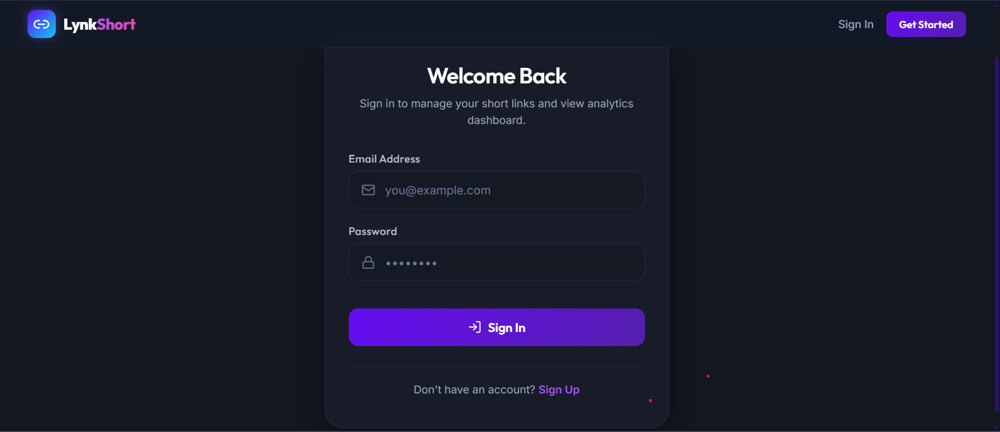

* Register Page

## Register Page

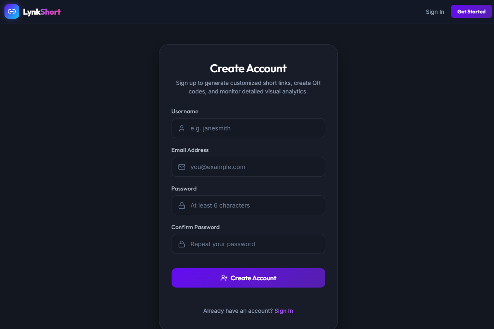

* Dashboard

## Dashboard Page

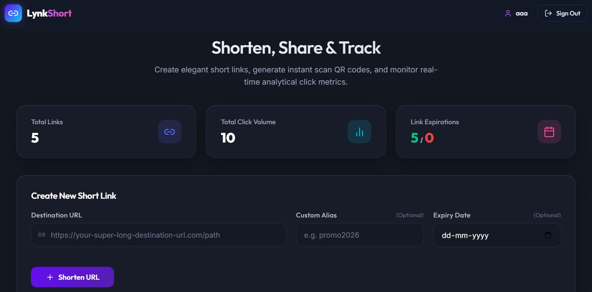

* Display

## Display

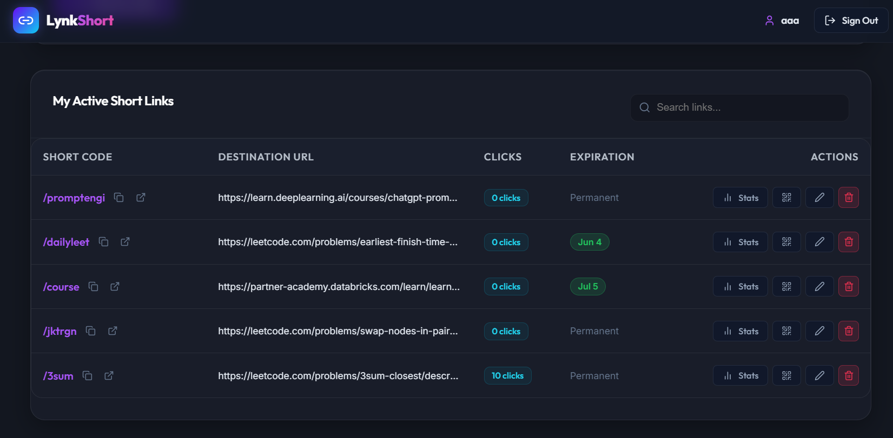

* Activities

## Activities

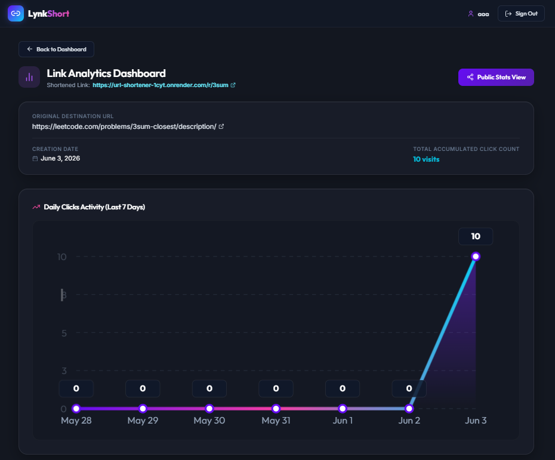

* Analytics Page

## Analytics Page

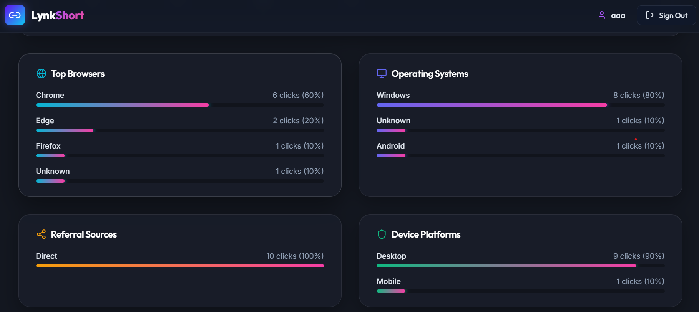

* Public Statistics Page

## Public Statistics Page

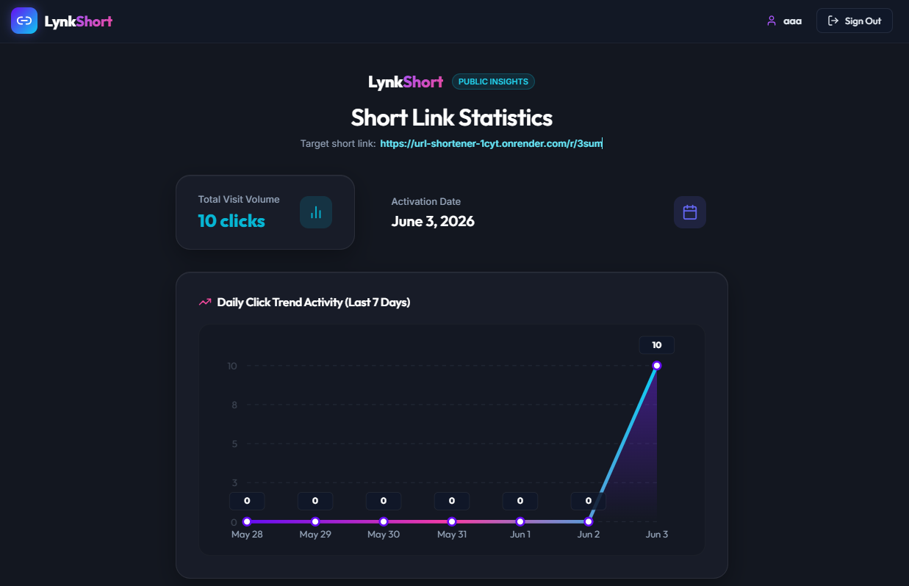

* Custom Alias

## Custom Alias

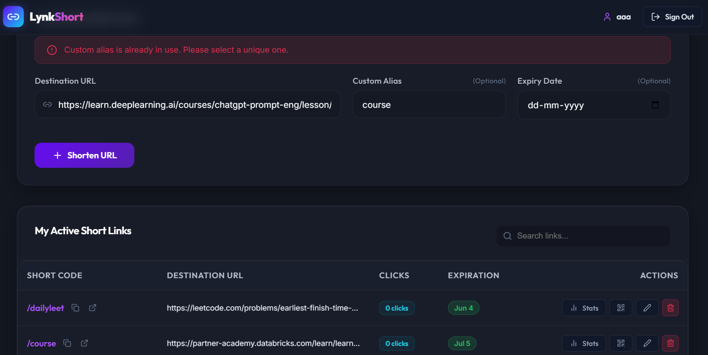

* QR Code 

## QR Code

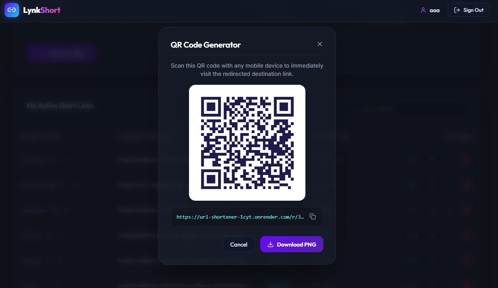

* Edit

## Edit

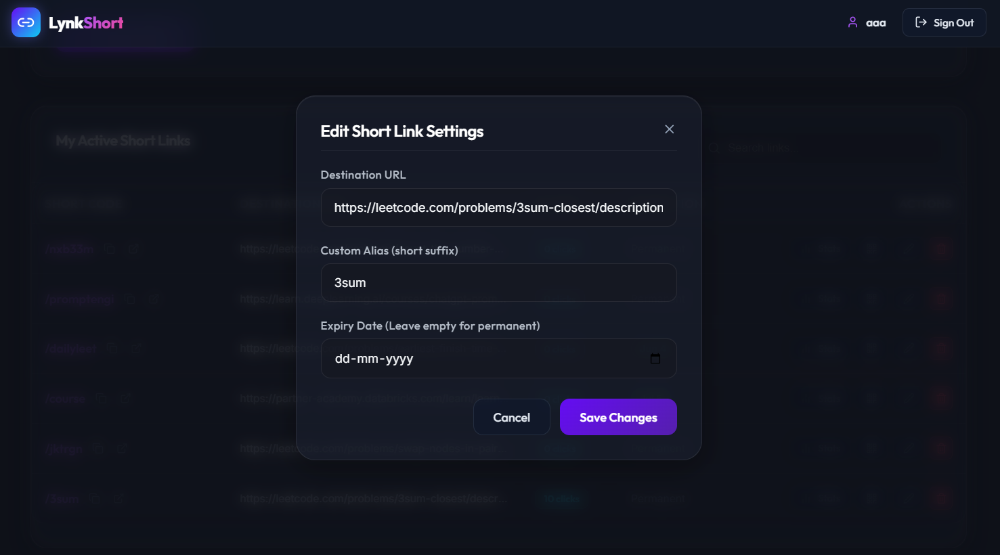

* Delete

## Delete

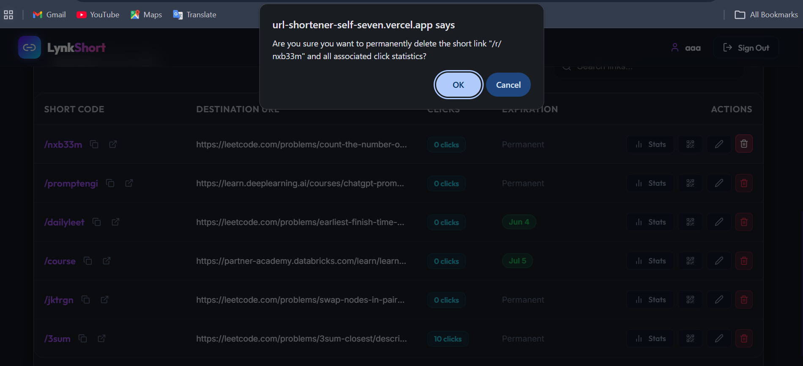


---

# Author

Mawiyah H

B.Tech Information Technology

Sri Shakthi Institute of Engineering and Technology

---

This project is a part of a hackathon run by https://katomaran.com
